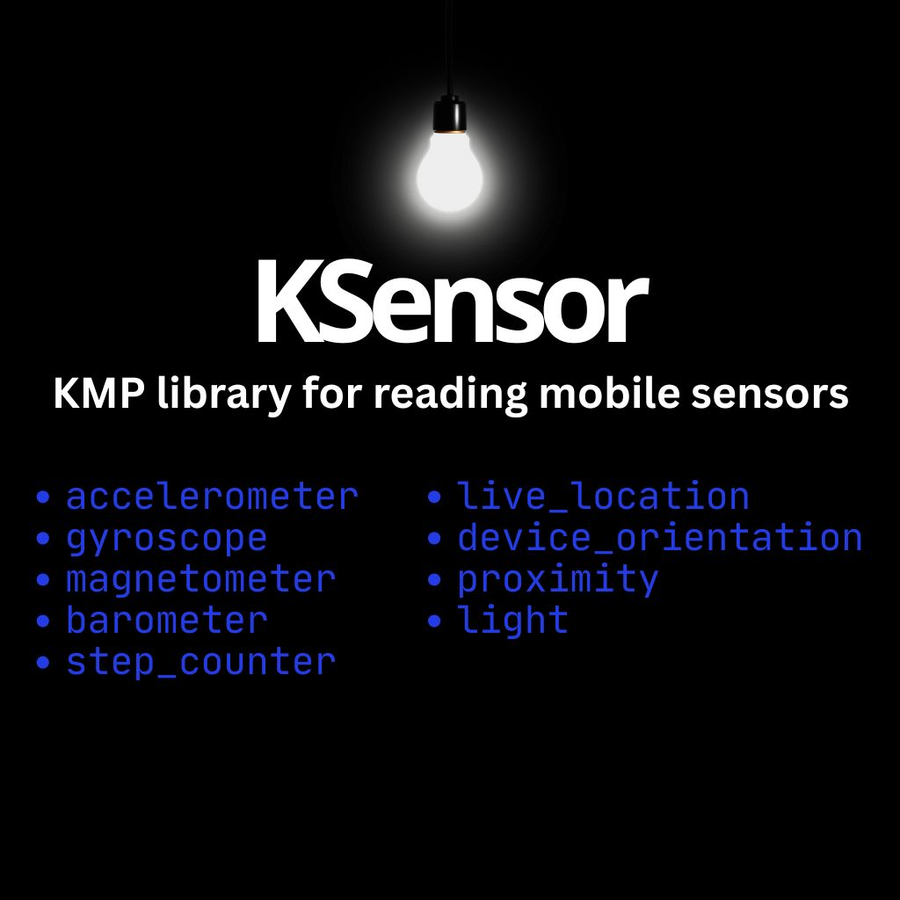

[](https://kotlinlang.org/)
[](https://gradle.org/)
[](https://opensource.org/licenses/Apache-2.0)



### latest supported sensors:

    ACCELEROMETER
    GYROSCOPE
    MAGNETOMETER
    BAROMETER
    STEP_COUNTER
    LOCATION
    DEVICE_ORIENTATION
    PROXIMITY
    LIGHT

<!-- GETTING STARTED -->
## Getting Started
### Adding dependencies
Add it in your `commonMain.dependencies` :

  ```
  implementation("io.github.shadmanadman:KSensor:0.80.11")
  ```

### Usage
```
//Create a list of sensors that you need
val sensors = listof(
SensorType.ACCELEROMETER,
SensorType.GYROSCOPE,
SensorType.MAGNETOMETER,
SensorType.BAROMETER,
SensorType.STEP_COUNTER,
SensorType.LOCATION,
SensorType.DEVICE_ORIENTATION,
SensorType.PROXIMITY,
SensorType.LIGHT)

// Register sensors
KSensor.registerSensors(
    types = sensors,
    locationIntervalMillis = {optional. default is 1000L}
).collect {sensorUpdate ->
    when (sensorUpdate) {
        is SensorUpdate.Data -> println(sensorUpdate.data)
        is SensorUpdate.Error -> println(sensorUpdate.exception)
    }
}

// Unregister sensors when no longer needed
KSensor.unregisterSensors(sensors)
```
Each `SensorData` has a `platformType` so you know the sensor data comes from Android or iOS.

#### Permissions
If you are using Location you need `FINE_LOCATION` and `COARSE_LOCATION` permissions on Android. You can handel this permissions yourself or let the library handle them for you:
```
    //Put this in AndroidManifest
    <uses-permission android:name="android.permission.ACCESS_COARSE_LOCATION"/>
    <uses-permission android:name="android.permission.ACCESS_FINE_LOCATION"/>
```
Inside a composable call:
```
KSensor.HandelPermissions() { status ->
    when (status) {
        PermissionStatus.Granted -> println("Permission Granted")
        PermissionStatus.Denied -> println("Permission Denied")
    }
}
```
The iOS location permission is handled by the library itself.


